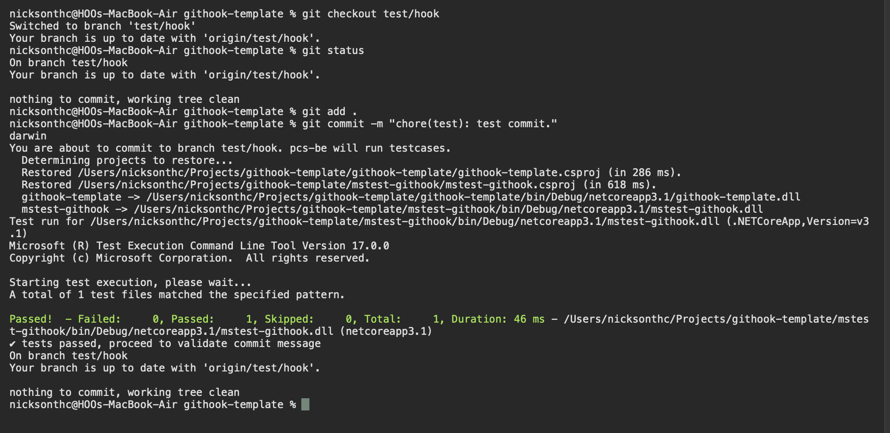
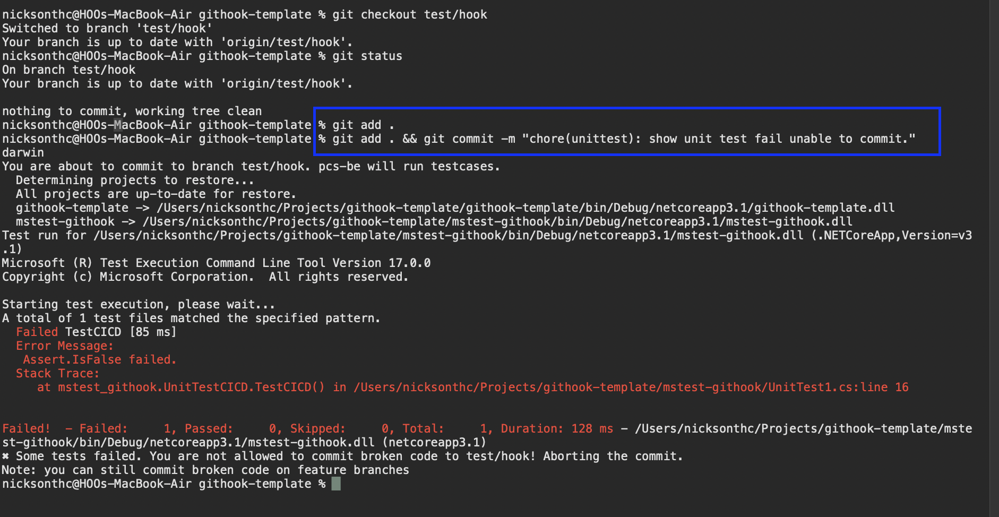

# About
This project contain only basic test and with local machine git hook example.
a. git hook will trigger pre-commit to run test case if you commit branch that not include in master or main
b. git hook will not allow you directly commit to master or main unless you add -n to skip the validation.
c. git hook will trigger commit-msg to check for the conventional commit message, commit message must follow the sample below.
`
feat(order): added order interstation flow\" or \"fix: slimy bug\""
`

d. Pattern allowed
`
build|chore|ci|docs|feat|fix|merge|perf|refactor|revert|style|test|BREAKING
`

# Example output 
## MacOS

# Setup Instruction
Runtime prerequisite
- Dotnet core 3.1

To set git hook executable folder path
- git config core.hooksPath githooks

For macOS set right
- chmod ug+x githooks/*

